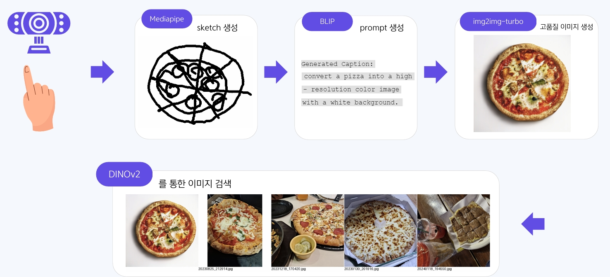
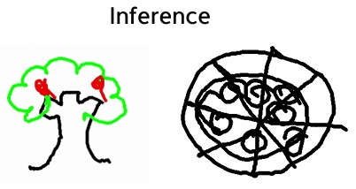
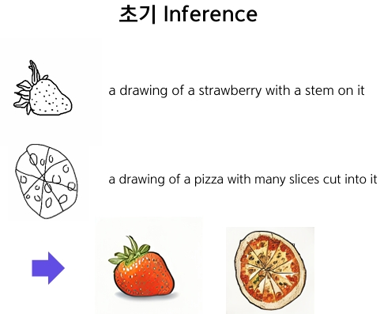
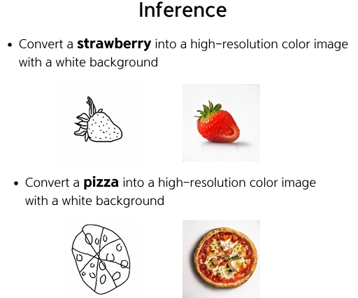
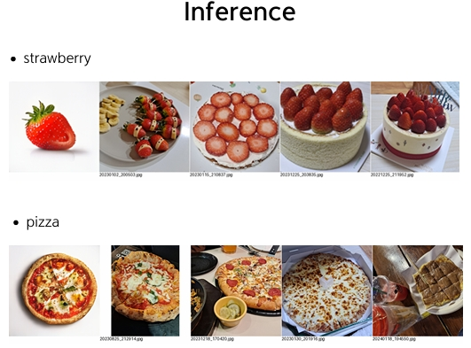
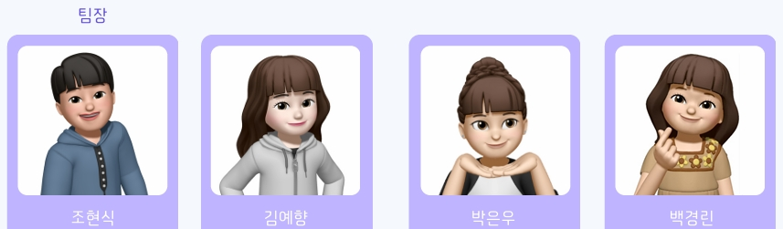

# Sketch2image-and-Image-Retrieval
2024 D&X:W Conference CV Team
 이 프로젝트는 스케치를 통한 이미지 검색 기능을 구현한 AI 모델입니다. Sketch2Image를 통해 사용자가 갤러리에 저장된 이미지를 검색할 수 있도록 하였으며, Mediapipe, BLIP, Diffusion, DINOv2등의 기술을 사용하였습니다.

## 프로젝트 개요 & 프로젝트 Flow
- **목적**: 마우스와 키보드를 사용하지 않고 손가락 제스처로 스케치를 그려 갤러리 내 유사한 이미지를 검색할 수 있는 시스템 개발
- **주요 기능**:
    - **스케치 캡셔닝**: 손가락 제스처로 그린 스케치를 설명하는 캡션 생성
    - **디퓨전 모델**: 스케치와 스케치 캡션을 입력으로 받아 고해상도 이미지를 생성
    - **이미지 검색**: 생성된 이미지를 기반으로 갤러리에서 유사한 이미지를 검색
  

## 주요 모델 및 기술
**1. Mediapipe**:
   - 손가락 제스처를 추적하여 스케치 생성
   - 한 손가락으로 스케치 저장, 여러 손가락 제스처로 색상 선택 및 지우개 기능 수행
   - 상세:
     - 한 손가락 -> 스케치 저장
     - 두 손가락 -> 검정색 펜
     - 세 손가락 -> 초록색 펜
     - 네 손가락 -> 빨간색 펜
     - 다섯 손가락 -> 지우개
     - R키 -> 전체 삭제
    
  

**2. BLIP (Bootstrapped Language-Image Pre-training)**:
   - 멀티모달 모델로, 스케치에 대한 캡션 생성
   - 생성된 캡션을 디퓨전 모델의 프롬프트로 사용

 초기 BLIP 인퍼런스 도출 시, 아래 왼쪽 그림과 같이 'a drawing of ~'로 캡셔닝 되어, 이것을 디퓨전 모델에 넣었을 때 그림체 느낌의 이미지가 생성되었습니다. 하지만 저희 팀은 고품질 이미지가 생성되기를 원했기 때문에, 실험을 통해 고품질 이미지로 변환할 수 있는 문장을 알아내고자 했고, 'Convert a [class] into a high-resolution color image with a white backgroud' 라는 문장을 찾았습니다. 따라서 스케치를 넣었을 때 해당 캡션이 생성되도록 Sketchy Dataset의 Sketch와 그에 대한 캡션으로 데이터셋을 만들어 이것으로 BLIP을 파인튜닝하였습니다. 그 결과 스케치에 대한 캡션과 생성된 이미지는 아래 오른쪽 그림과 같이 나왔습니다.

<p align="center">
  
  
</p>

**3. Img2Img-Turbo**:
   - 생성된 캡션을 바탕으로 고해상도 컬러 이미지를 생성
   - 30만 개의 예술 이미지를 사용하여 Adversarial Learning으로 학습된 모델
   - LoRA를 활용해 경량화 학습
   - inference는 위의 그림과 같음

**4. DINOv2 (Distillation of Knowledge with Neural Operators)**:
   - ViT-H/16모델을 사용해 임베딩 생성
   - 코사인 유사도를 사용해 이미지 간 거리를 계산해 의미론적으로 비슷한 이미지들을 가깝게 배치
     
     

## 프로젝트 환경
**1. 하드웨어 사양**
  - GPU: T4

**2. 소프트웨어 환경**
  - CUDA: 12.2
  - Python:3.10.12

**3. 필수 라이브러리**
  - requirements.txt에 명시

**4. 실행환경**
  - 로컬 GPU 환경에서 실행이 가능합니다.
  - 다만, 로컬에 GPU가 없다면 구글 Colab에서 main2.py 실행으로 이미지 재생성과 검색을 구현하실 수 있습니다. 로컬 환경에서 스케치를 그리고, 해당 스케치 경로를 image_path에 입력하면 됩니다.

## DataSet
- **Sketchy Dataset**:
  - 총 12개의 카트고리 중 39개 카테고리 선택 (카테고리 리스트는 REAME_image 폴더 안에서 확인가능)
  - 각 스케치에 대한 텍스트 프롬프트를 추가하여 BLIP 파인튜닝에 활용

## CheckPoints

- [다운로드](https://drive.google.com/drive/folders/16tHzOjyHXhN-VVOLXzvbGTfwh5uv1Sff?usp=sharing)

## 실행 방법
1. **환경 설정**:
   - 깃허브 내용을 다운받습니다.
      ```bash
       git clone https://github.com/justpers/Sketch2Image-and-ImageRetrieval.git
      ```
   - CheckPoints에서 가중치를 다운받아 올바른 경로에 놓습니다.

   - 프로젝트의 요구 사항을 설치합니다.
     ```bash
     pip install -r requirements.txt
     ```
  
2. **ADB를 통해 갤럭시 장치와 연결**:
   - 기기에 ADB를 설치한 후, main 파일을 실행합니다.
     ```bash
     python main.py
     ```

3. **스케치 입력 및 이미지 검색**:
   - 손가락 제스처로 스케치를 그리고, 이를 통해 캡션 생성 및 이미지 검색을 진행합니다.

## Reference
- [CVZone Repository](https://github.com/cvzone/cvzone)
- [DINOv2 Repository](https://github.com/vra/dinov2-retrieval)
- [Img2Img-Turbo Repository](https://github.com/GaParmar/img2img-turbo)
- [Sketchy Dataset](https://github.com/CDOTAD/SketchyDatabase)
- [BLIP_finetunning Dataset](https://huggingface.co/datasets/justpers/BLIP_finetunning)

## 팀 소개
- 저희 팀은 국민대 AI빅데이터융합경영학과 학생들로 이루어져있습니다.
   
